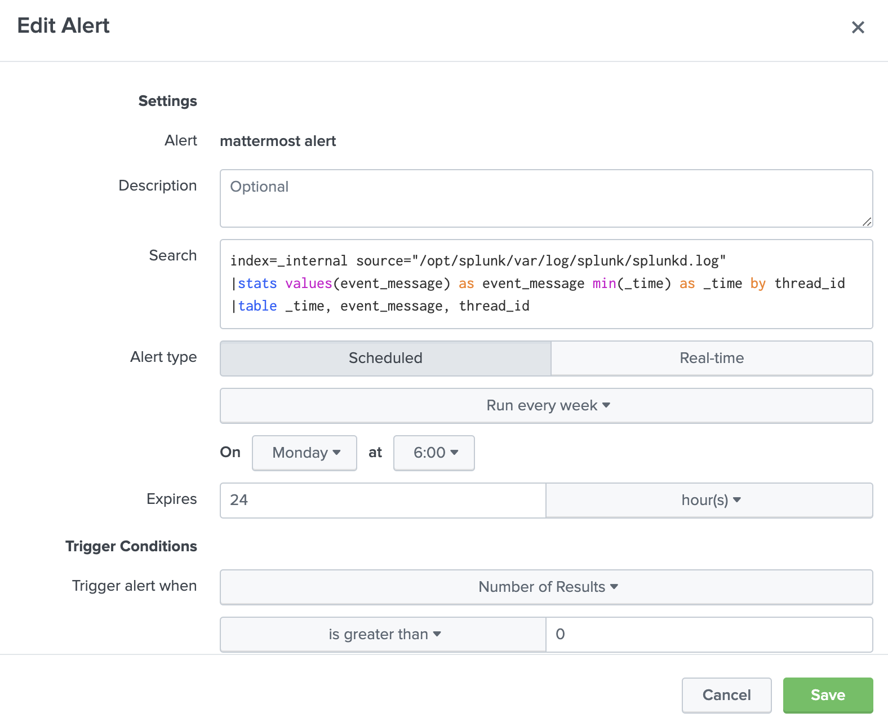
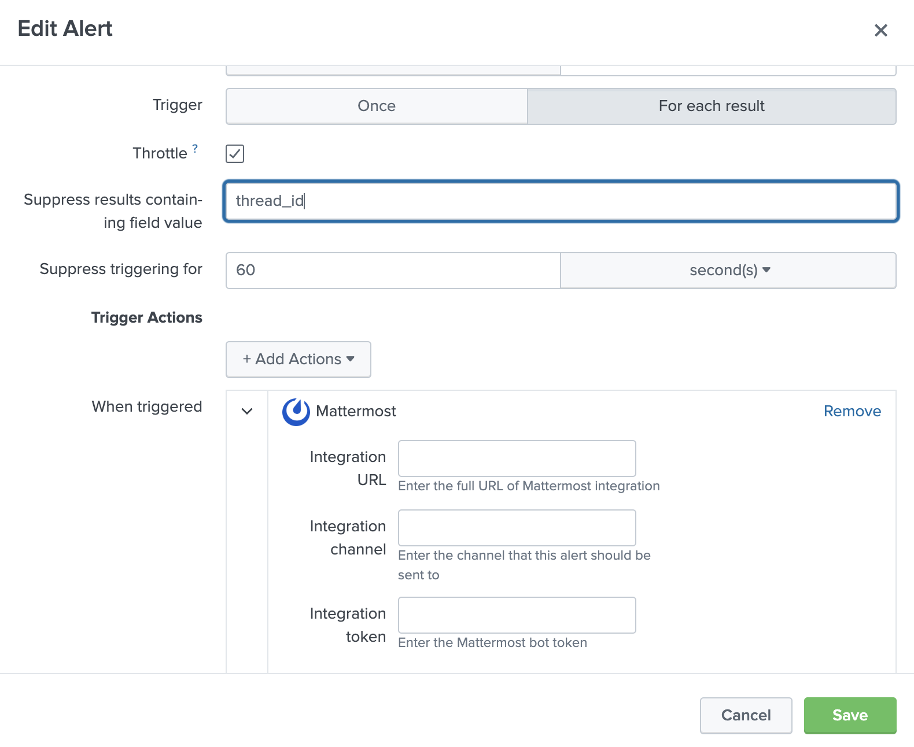
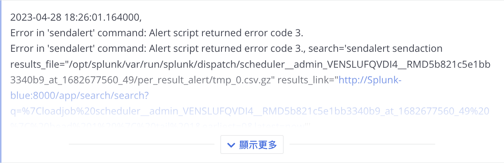

# Mattermost APP for Splunk

Now an app that can  push alert result to a Mattermost channel.
## Install

- Can install by `splunk_mattermost.tar.gz`.
- Or move folder to `/opt/splunk/etc/apps `.
### First, create an alert.

- By using this search, we can monitor the Splunk log.
- Search grouping by thread_id ensures that messages are correctly and completely captured.


```
index=_internal source="/opt/splunk/var/log/splunk/splunkd.log"
|stats values(event_message) as event_message min(_time) as _time by thread_id
|table _time, event_message, thread_id
```

- Trigger `For each result`.
- Throttle `thread_id`.
- Suppressing time is optional and can be chosen based on your preferences.



### Alert be like


